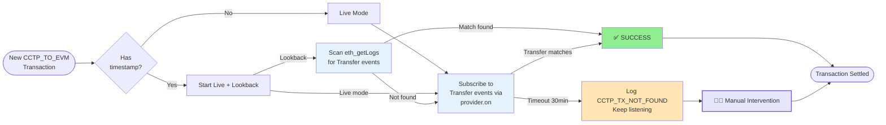
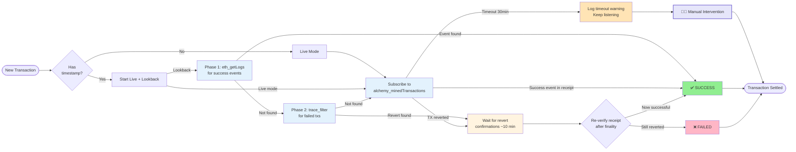
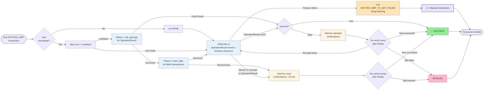

# Resolver Service

## Overview

The resolver service monitors and resolves transactions between Agoric and remote EVM chains. "Resolving" implies determining and reporting the transaction status (SUCCESS or FAILED) back to the ymax contract. It uses WebSocket connections to listen for specific events on EVM chains and automatically marks transactions as resolved when the expected events are detected.

## How It Works

The resolver:
- Maintains active WebSocket connections to EVM chains via Alchemy
- Listens for specific contract events based on transaction type
- Automatically resolves transactions when expected events are detected
- Supports two operating modes: **live** (real-time WebSocket subscriptions) and **lookback** (historical block scanning)
- Persists scan progress in a SQLite KV store so block scanning can resume after planner restarts

## Supported Transaction Types

### 1. MAKE_ACCOUNT

**Purpose:** Creates a remote EVM wallet for a user.

**How it resolves:**
- Subscribes to `alchemy_minedTransactions` for the Factory or DepositFactory contract address
- Supports two transaction paths:
  - **makeAccount mode:** Transaction sent directly to the Factory contract
  - **createAndDeposit mode:** Transaction sent to the DepositFactory contract (the Factory still emits the `SmartWalletCreated` event)
- Parses the Axelar `execute(bytes32, string, string, bytes)` calldata to extract the `expectedWalletAddress` and `sourceAddress`
- Validates that both `sourceAddress` (the LCA address) and `expectedWalletAddress` match the pending transaction
- Checks the receipt for a `SmartWalletCreated` event matching the expected wallet address


**Failure detection:**

- **Via revert:** If the transaction reverts (receipt `status=0`), waits for confirmations (~10 minutes / block time) via `handleTxRevert()` before confirming the failure
- **Via lookback:** Scans historical blocks for failed transactions using `trace_filter` on supported chains (Ethereum, Base, Optimism)

**Detection modes:**
- **Live mode:** Subscribes to `alchemy_minedTransactions` for the factory address
- **Lookback mode:** Scans historical blocks in two phases:
  1. **Phase 1 (cheap):** Scans `eth_getLogs` for `SmartWalletCreated` events (both v1 and v2 signatures concurrently)
  2. **Phase 2 (if Phase 1 finds nothing):** Scans for failed transactions via `trace_filter` (on supported chains)

---

### 2. CCTP_TO_EVM

**Purpose:** Transfers USDC from Agoric to a remote EVM wallet via CCTP (Cross-Chain Transfer Protocol).

**How it resolves:**
- Listens for ERC-20 `Transfer` events from the USDC token contract
- Automatically resolves when a transfer matches all conditions:
  - **Recipient address:** Transfer TO the expected remote EVM wallet address
  - **Token contract:** Event emitted by the correct USDC token contract address
  - **Amount:** Exact match of the expected USDC amount

**Detection modes:**
- **Live mode:** Uses `provider.on(filter)` with ethers event filtering by `Transfer` topic and recipient address
- **Lookback mode:** Scans historical blocks using `scanEvmLogsInChunks()` with `eth_getLogs`

**Limitations:**
- Cannot detect CCTP failures automatically
- Failures require manual resolution

---

### 3. GMP (General Message Passing)

**Purpose:** Deploys or withdraws funds from the remote EVM wallet to/from an EVM protocol.

**How it resolves:**
- Subscribes to `alchemy_minedTransactions` for the destination contract (remote EVM wallet) address
- Parses the Axelar `execute(bytes32, string, string, bytes)` calldata to extract the `txId` and `sourceAddress` via `extractGmpExecuteData()`
- The payload is decoded as `CallMessage { string id; ContractCalls[] calls; }` — the `id` field is the transaction ID
- Validates that both `txId` and `sourceAddress` (the LCA address) match the pending transaction
- Checks the receipt for a `MulticallStatus(string,bool,uint256)` event where `topics[1]` matches `keccak256(txId)`

**Failure detection:**
- **Via revert:** If the transaction reverts (receipt status=0) and the `sourceAddress` matches the expected LCA address, waits for confirmations (~10 minutes / block time) via `handleTxRevert()` before confirming the failure
- **Via lookback:** Scans historical blocks for failed transactions using `trace_filter` on supported chains (Ethereum, Base, Optimism)

**Finality protection:**
- Before confirming a failure, the resolver waits for additional block confirmations to guard against blockchain reorgs
- **For reverted transactions (status=0):** Waits for a higher confirmation threshold computed from a 10-minute window (`REVERT_WAIT_TIME_MS / blockTime`). This gives Axelar relayers time to retry the transaction. After the wait, re-checks the receipt — if the transaction is now successful (reorg flipped it), reports success instead
- **Resubmission during confirmation wait:** If Axelar resubmits the transaction while the resolver is waiting for revert confirmations, the subscription remains active and catches the new transaction. Each incoming message is handled by an independent async invocation, so a successful resubmission resolves immediately via a `done` flag. When the original revert confirmation completes, its resolution attempt is a no-op because `done` is already true. This prevents double resolution.

**Detection modes:**
- **Live mode:** Subscribes to `alchemy_minedTransactions` for the contract address
- **Lookback mode:** Scans historical blocks in two phases:
  1. **Phase 1 (cheap):** Scans `eth_getLogs` for `MulticallStatus` events
  2. **Phase 2 (if Phase 1 finds nothing):** Scans for failed transactions via `trace_filter` (on supported chains)

---

### 4. ROUTED_GMP

**Purpose:** Handles account creation, deposit, and multicall operations routed through the PortfolioRouter contract.

**How it resolves:**
- Listens for `OperationResult` events from the PortfolioRouter contract
- Event signature:
  ```
  OperationResult(
    string indexed id,
    string indexed sourceAddressIndex,
    string sourceAddress,
    address indexed allegedRemoteAccount,
    bytes4 instructionSelector,
    bool success,
    bytes reason
  )
  ```
- Resolves when an event matches:
  - **ID:** The keccak256 hash of the padded txId matches `topics[1]`

**txId Matching:**
- The txId (e.g. `tx42`) is padded with null bytes to match the length of the sourceAddress (LCA address)
- Also, the `payloadHash` (keccak256 of the Axelar execute payload) can be used as a fallback identifier
- A transaction matches if **either** the padded txId or payloadHash matches the on-chain calldata

**Failure detection:**
- **Via event:** If `OperationResult` is emitted with `success=false`, the transaction is marked as failed after finality confirmation
- **Via revert:** If the transaction reverts (status=0) without emitting an `OperationResult` event, this is also detected and reported as a failure

**Finality protection:**
- Before confirming a failure, the resolver waits for additional block confirmations to guard against blockchain reorgs
- **For failed events (`success=false`):** Waits for the standard confirmation threshold (e.g. 25 blocks), then re-checks that the event still exists in the finalized block. If the event was removed by a reorg, the resolver continues watching
- **For reverted transactions (status=0):** Waits for a higher confirmation threshold computed from a 10-minute window (`REVERT_WAIT_TIME_MS / blockTime`). This gives Axelar relayers time to retry the transaction. After the wait, re-checks the receipt — if the transaction is now successful (reorg flipped it), reports success instead
- **Resubmission during confirmation wait:** If Axelar resubmits the transaction while the resolver is waiting for revert confirmations, the subscription remains active and catches the new transaction. Each incoming message is handled by an independent async invocation, so a successful resubmission resolves immediately via a `done` flag. When the original revert confirmation completes, its resolution attempt is a no-op because `done` is already true. This prevents double resolution.

**Detection modes:**
- **Live mode:** Subscribes to real-time events via WebSocket and also monitors `alchemy_minedTransactions` for early revert detection
- **Lookback mode:** Scans historical blocks in two phases:
  1. **Phase 1 (cheap):** Scans `eth_getLogs` for `OperationResult` events
  2. **Phase 2 (if Phase 1 finds nothing):** Scans for failed transactions via `trace_filter`
- Both modes run concurrently when a transaction timestamp is available, ensuring no gap in coverage

---

## Timeout Behavior

When a transaction is not resolved within 30 minutes (`TX_TIMEOUT_MS`):

- A single log message is emitted with a stable error code prefix (e.g., `GMP_TX_NOT_FOUND`, `WALLET_TX_NOT_FOUND`, `CCTP_TX_NOT_FOUND`, `ROUTED_GMP_TX_NOT_FOUND`)
- Ops alerting in `#ops-ymax-resolver` matches on these stable codes
- The timeout **does not** resolve or reject the watcher — it only logs. The watcher continues running indefinitely until either:
  - The expected event is detected
  - The on-chain pending tx status changes (triggering an abort via `AbortController`)
  - The resolver service is restarted

---

## Settlement Notification

When a transaction is settled (success or failure), two actions occur:
1. **On-chain resolution:** `resolvePendingTx()` submits a `SettleTransaction` offer to the Agoric smart wallet
2. **YDS notification (optional):** If configured, `YdsNotifier.notifySettlement()` sends a POST to the YDS `/flow-step-tx-hashes` endpoint with the txId and EVM transaction hash

---

## Summary Matrix

| Transaction Type | Listens For | Contract Monitored | Live Mechanism | Auto-Resolve Success | Auto-Detect Failure |
|-----------------|-------------|-------------------|----------------|---------------------|---------------------|
| MAKE_ACCOUNT | `SmartWalletCreated` | Factory / DepositFactory | `alchemy_minedTransactions` | ✅ | ✅ (via revert + trace_filter) |
| CCTP_TO_EVM | ERC-20 `Transfer` | USDC Token | `provider.on(filter)` | ✅ | ❌ |
| GMP | `MulticallStatus` | Remote EVM Wallet | `alchemy_minedTransactions` | ✅ | ✅ (via revert + trace_filter) |
| ROUTED_GMP | `OperationResult` | PortfolioRouter | `provider.on(filter)` + `alchemy_minedTransactions` | ✅ | ✅ (via event + revert + trace_filter) |

---

## Transaction Resolution Flows

### CCTP_TO_EVM


### MAKE_ACCOUNT / GMP


### ROUTED_GMP

