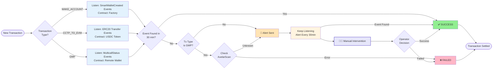

# Resolver Service

## Overview

The resolver service monitors and resolves transactions between Agoric and remote EVM chains."Resolving" implies determining and reporting the transaction status (SUCCESS or FAILED) back to the ymax contract. It uses WebSocket connections to listen for specific events on EVM chains and automatically marks transactions as resolved when the expected events are detected.

## How It Works

The resolver:
- Maintains active WebSocket connections to EVM chains
- Listens for specific contract events based on transaction type
- Automatically resolves transactions when expected events are detected
- Sends alerts when transactions cannot be resolved automatically
- Never gives up on a transaction unless manually resolved

## Supported Transaction Types

### 1. MAKE_ACCOUNT

**Purpose:** Creates a remote EVM wallet for a user.

**How it resolves:**
- Listens for `SmartWalletCreated` events from the [Factory contract](https://github.com/agoric-labs/agoric-to-axelar-local/blob/c5b5b2892fe4fe3f822ba460dc9b35239a3fdc2e/packages/axelar-local-dev-cosmos/src/__tests__/contracts/Factory.sol#L155)
- Automatically resolves when event matches:
  - **Wallet address:** The created wallet address matches the expected address

**Limitations:**
- Cannot detect failures automatically
- Failures require manual resolution

---

### 2. CCTP_TO_EVM

**Purpose:** Transfers USDC from Agoric to a remote EVM wallet via CCTP (Cross-Chain Transfer Protocol).

**How it resolves:**
- Listens for ERC20 `Transfer` events from the USDC token contract
- Automatically resolves when a transfer matches all conditions:
  - **Recipient address:** Transfer TO the expected remote EVM wallet address
  - **Token contract:** Transfer FROM the USDC token contract (exact match)
  - **Amount:** Exact match of the expected USDC amount

**Limitations:**
- Cannot detect CCTP failures automatically
- Failures require manual resolution

---

### 3. GMP (General Message Passing)

**Purpose:** Deploys or withdraws funds from the remote EVM wallet to/from an EVM protocol.

**How it resolves:**
- Listens for `MulticallStatus` events from the [remote EVM wallet](https://github.com/agoric-labs/agoric-to-axelar-local/blob/c5b5b2892fe4fe3f822ba460dc9b35239a3fdc2e/packages/axelar-local-dev-cosmos/src/__tests__/contracts/Factory.sol#L82)
- Automatically resolves when event matches:
  - **Transaction ID:** The event's txId hash matches the expected transaction ID

**Failure detection:**
- After 30 minutes without resolution, checks [AxelarScan](https://axelarscan.io/) for transaction status
- If AxelarScan confirms failure, automatically marks transaction as "failed"
- If AxelarScan has no record, proceeds to alerting (see below)

---

### 4. ROUTED_GMP

**Purpose:** Handles account creation, deposit, and multicall operations routed through the PortfolioRouter contract.

**How it resolves:**
- Listens for `OperationResult` events from the PortfolioRouter contract
- Event signature:
  ```
  OperationResult(
    string indexed id,
    string indexed sourceAddressIndex,
    string sourceAddress,
    address indexed allegedRemoteAccount,
    bytes4 instructionSelector,
    bool success,
    bytes reason
  )
  ```
- Resolves when an event matches:
  - **ID:** The keccak256 hash of the padded txId matches `topics[1]`

**txId Matching:**
- The txId (e.g. `tx42`) is padded with null bytes to match the length of the sourceAddress (LCA address)
- Also, the `payloadHash` (keccak256 of the Axelar execute payload) can be used as a fallback identifier
- A transaction matches if **either** the padded txId or payloadHash matches the on-chain calldata

**Failure detection:**
- **Via event:** If `OperationResult` is emitted with `success=false`, the transaction is marked as failed after finality confirmation
- **Via revert:** If the transaction reverts (status=0) without emitting an `OperationResult` event, this is also detected and reported as a failure

**Finality protection:**
- Before confirming a failure, the resolver waits for additional block confirmations to guard against blockchain reorgs
- **For failed events (`success=false`):** Waits for the standard confirmation threshold (e.g. 25 blocks), then re-checks that the event still exists in the finalized block. If the event was removed by a reorg, the resolver continues watching
- **For reverted transactions (status=0):** Waits for a higher confirmation threshold computed from a 10-minute window (`REVERT_WAIT_TIME_MS / blockTime`). This gives Axelar relayers time to retry the transaction. After the wait, re-checks the receipt — if the transaction is now successful (reorg flipped it), reports success instead

**Detection modes:**
- **Live mode:** Subscribes to real-time events via WebSocket and also monitors `alchemy_minedTransactions` for early revert detection
- **Lookback mode:** Scans historical blocks in two phases:
  1. **Phase 1 (cheap):** Scans `eth_getLogs` for `OperationResult` events
  2. **Phase 2 (if Phase 1 finds nothing):** Scans for failed transactions via `eth_getBlockReceipts` or `trace_filter`
- Both modes run concurrently when a transaction timestamp is available, ensuring no gap in coverage

---

## Alert System

### When Alerts Are Triggered

Alerts are sent when:
- **MAKE_ACCOUNT / CCTP_TO_EVM:** No expected event after 30 minutes
- **GMP:** No expected event after 30 minutes AND no status found on AxelarScan
- **ROUTED_GMP:** No `OperationResult` event and no failed transaction detected after 30 minutes

### Alert Behavior

- Alerts are sent every 30 minutes until the transaction is resolved
- The resolver **continues processing** the transaction even after alerting
- WebSocket listeners remain active
- For GMP transactions, AxelarScan checks continue periodically
- The resolver never abandons a transaction

---

## Summary Matrix

| Transaction Type | Listens For | Contract Monitored | Auto-Resolve Success | Auto-Detect Failure |
|-----------------|-------------|-------------------|---------------------|---------------------|
| MAKE_ACCOUNT | `SmartWalletCreated` | Factory | ✅ | ❌ |
| CCTP_TO_EVM | ERC20 `Transfer` | USDC Token | ✅ | ❌ |
| GMP | `MulticallStatus` | Remote EVM Wallet | ✅ | ✅ (via AxelarScan) |
| ROUTED_GMP | `OperationResult` | PortfolioRouter | ✅ | ✅ (via event + revert detection) |

---


---

## Transaction Resolution Flow

### MAKE_ACCOUNT / CCTP_TO_EVM / GMP


### ROUTED_GMP

```mermaid
flowchart LR
  Start([New ROUTED_GMP<br/>Transaction]) --> Mode{Has<br/>timestamp?}

  Mode -->|No| LiveOnly[Live Mode]
  Mode -->|Yes| Both[Start Live + Lookback]

  %% Live-only path
  LiveOnly --> LiveSub

  %% Lookback path: start live, then scan historical blocks
  Both -->|Live mode| LiveSub[Subscribe to<br/>OperationResult events +<br/>Alchemy mined txs]
  Both -->|Lookback| Phase1[Phase 1: eth_getLogs<br/>for OperationResult]

  Phase1 -->|Event found| EventCheck{success?}
  Phase1 -->|Not found| Phase2[Phase 2: Scan for<br/>failed transactions]

  Phase2 -->|Revert found| Finality2[Wait for revert<br/>confirmations ~10 min]
  Phase2 -->|Wait for Live mode| LiveSub

  %% Live watcher detection paths
  LiveSub -->|OperationResult event| EventCheck
  LiveSub -->|Mined TX reverted<br/>no OperationResult| Finality2

  %% Success / failure handling
  EventCheck -->|true| Success[✅ SUCCESS]
  EventCheck -->|false| Finality1[Wait for standard<br/>confirmations]

  Finality1 --> Recheck1{Re-verify event<br/>after finality}
  Recheck1 -->|Still failed| Failed[❌ FAILED]
  Recheck1 -->|Now successful| Success
  Recheck1 -->|Reorged away| LiveSub

  Finality2 --> Recheck2{Re-verify receipt<br/>after finality}
  Recheck2 -->|Still reverted| Failed
  Recheck2 -->|Now successful| Success

  %% Timeout / alerting
  LiveSub -->|Timeout 30min| Alert[🔔 Alert Sent]
  Alert --> Loop[Keep Listening<br/>Alert Every 30min]
  Loop -->|Event Found| EventCheck
  Loop --> Manual[🧑‍💻 Manual Intervention]
  Manual --> Decide{Operator<br/>Decision}
  Decide -->|Success| Success
  Decide -->|Failed| Failed

  Success --> Done([Transaction Settled])
  Failed --> Done

  style Success fill:#90EE90
  style Failed fill:#FFB6C6
  style Phase1 fill:#E3F2FD
  style Phase2 fill:#E3F2FD
  style LiveSub fill:#E3F2FD
  style Finality1 fill:#FFF4E0
  style Finality2 fill:#FFF4E0
  style Alert fill:#FFE4B5
  style Loop fill:#FFF4E0
  style Manual fill:#E6E6FA,stroke:#6A5ACD,stroke-width:2px

```

